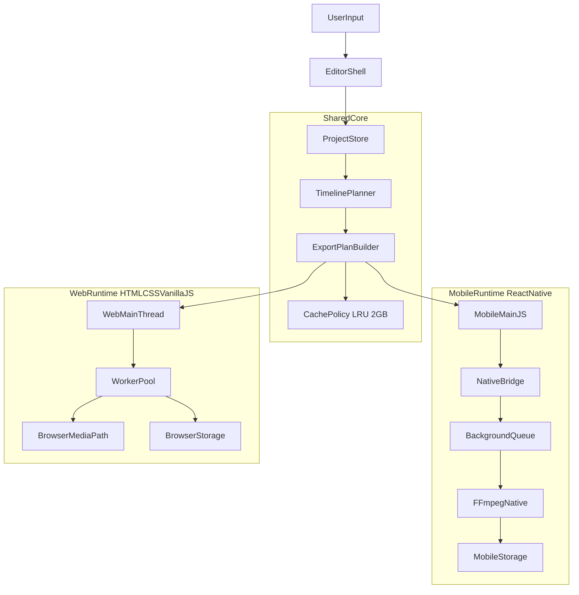

# Architecture

## What you are building

A dual-platform short-form video editor with one shared planning core and two execution runtimes:

- Mobile app built on React Native CLI + TypeScript + native FFmpeg.
- Web app built on HTML + CSS + Vanilla JS.

No UI feature implementation is included in Step 1; only architecture modules and system contracts are defined.

## Architecture diagram (text)

## Module boundaries

- `shared/contracts`: stable data contracts for project state and cache metadata.
- `shared/core`: pure deterministic planning logic with no platform side effects.
- `video-editor-mobile-app/app`: orchestration adapters for React Native runtime.
- `video-editor-mobile-app/native/ffmpeg`: native FFmpeg bridge contracts and command execution boundary.
- `video-editor-web-app/app`: Vanilla JS orchestration shell.
- `video-editor-web-app/workers`: worker-driven heavy processing orchestration.
